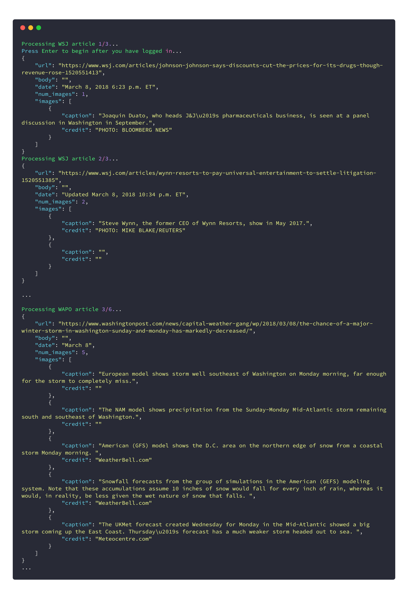

# twitter-article-scraper
[](https://www.python.org/) 

### Description 
**twitter-news-scraper** is an automated web scraper for dynamically scraping information from Tweeted news articles. It has been successfully used to collect image captions from 20 news publications, and over 2,000 articles for academic research. 

### Changelog
* **New in v0.2**
    * Updated to Python 3.7.0
    * Refactored to use Python Dataclasses and Pandas Dataframes
    * Now takes input Twitter data as CSV (handle, tweet)
    * Now outputs scraped data as JSON 
* *Coming in v0.3*
    * Automatic construction of datasets from Twitter feeds
    * More analysis tools
    * Multi-processing with Dask

### Requirements
1. Download [ChromeDriver](http://chromedriver.chromium.org/downloads) and add path to it in _driver.py_
3. Install requirements `pip install -r requirements.txt`

### Usage
Run **twitter-news-scraper** with `python3 driver.py`. Depending on the publication, you may need to log into their website before you begin scraping.

You can run a demo of **twitter-news-scraper** by running the included _demo.ipynb_ Jupyter notebook.

### Included Data
An example [Wall Street Journal](https://www.wsj.com/) dataset `example_data.csv` is provided. The data was collected from the [WSJ's Twitter account](https://twitter.com/WSJ) and is 140x2 with `handle` and `tweet` features. The dataset includes duplicates, invalid/null links, and a variety of article types which can all be dynamically processed by twitter-news-scraper. 

### Example Usage

_Scraping image captions from WSJ and WAPO articles_

##### Define Publication instances in _driver.py_
```python
tweets = read_csv('../example_data.csv')
urls = extract_tweeted_urls(tweets)

# WALL STREET JOURNAL
wsj_urls = urls.loc[0:2]

# Captures image captions of the form
# PARENT_CONTAINER
# ↳ CAPTION
# ↳ CREDIT
wsj_kwargs = {
    'images': [{
        'parent_div': 'div.wsj-article-caption',
        'caption_span': 'span.wsj-article-caption-content',
        'credit_span': 'span.wsj-article-credit'}],
    'date': 'time.timestamp'
}

wsj = Publication('WSJ', cookies={}, kwargs=wsj_kwargs)
wsj.articles = driver.scrape_articles(wsj, wsj_urls)
wsj.write('output.json')  # write output data
print_stats(wsj)

# WASHINGTON POST
 wapo_urls = urls.loc[163:168]

# Captures image captions of the form
# "example caption (example credit)"
def wapo_delimiter(caption: str) -> List[str]:
    splits = caption.rsplit('(', 1)
    output_splits: List[str] = []
    for split in splits:
        if split != '':
            split = split[:-1] if split[-1] == ')' else split
        output_splits.append(split)
    return output_splits

wapo_kwargs = {
    'images': [{
        'parent_div': 'span.pb-caption',
        'delimiter': wapo_delimiter}],
    'date': 'span.pb-timestamp'
}

wapo = Publication('WAPO', cookies={}, kwargs=wapo_kwargs)
wapo.articles = driver.scrape_articles(wapo, wapo_urls)
wapo.write('output2.json')
```

##### `python3 scrape.py` output
